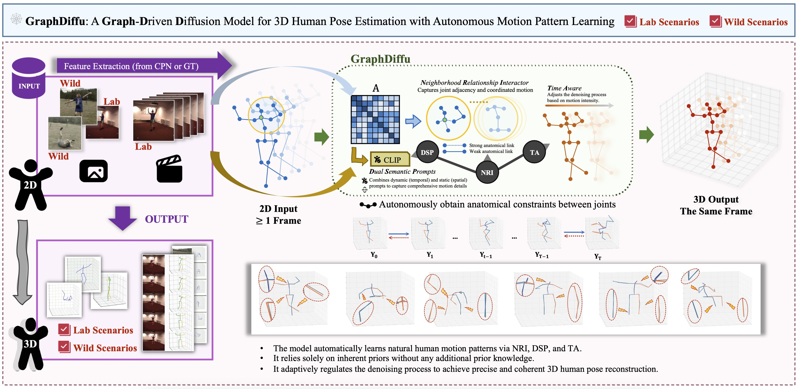

# PoseDiffusion+: Graph-Guided Diffusion with Temporal-Semantic Modulation for 3D Human Pose Estimation
<p align="justify">
Monocular 3D human pose estimation (HPE) remains challenging due to frequent occlusions, ambiguous depth cues, and the need for anatomically plausible joint coordination. A central limitation of many existing approaches is their insufficient modeling of inter-joint interactions. Treating joints as either isolated or weakly linked often leads to distorted limb configurations and disrupted motion continuity, especially during asynchronous or high-speed actions. To address this, we propose PoseDiffusion+, a diffusion framework that reconstructs 3D human poses by embedding both anatomical priors and motion semantics into the generative process. The core of our method is the anatomical graph diffuser , which models joint dependencies via a learnable skeletal graph, guiding the denoising process toward structurally consistent outcomes. To reinforce both spatial alignment and temporal flow, we introduce contextual motion prompts, a dual-branch mechanism that encodes (i) the semantic layout of the body and (ii) its dynamic motion state at each timestep, providing structural and temporal guidance throughout the denoising process. In addition, a temporal energy regulator adaptively modulates the denoising strength based on motion complexity, enhancing sharpness in rapid actions while maintaining stability in slower frames. Extensive experiments on Human3.6M and MPI-INF-3DHP show that PoseDiffusion+ achieves outstanding performance in both qualitative and quantitative evaluations.
</p>


| Dataset         | 2D Detector | MPJPE (Avg) ↓ | P-MPJPE (Avg) ↓ | PCK 🔺 | AUC 🔺 |
|---------------|------------|-----------|-------------|---------|---------|
| Human3.6M     | CPN        | -1.05 ↓ | -1.76 ↓   | —       | —       |
| Human3.6M     | GT         | -1.21 ↓ | -4.84 ↓   | —       | —       |
| MPI-INF-3DHP  | GT         | -0.40 ↓ | — | 99.14 (0.24 🔺) | 80.45 (0.45 🔺) |

<p align="center">

</p>

## Model Demo (Loading takes a while😊)
<p align="center">
  
  
</p>
<p align="center">
  
  
</p>
<p align="center">
  
  
</p>
<p align="center">
  
  
</p>


---

## Train & Inference

### A. Human3.6M

(1) Train poseDiffusion (using the 2D keypoints obtained by CPN as inputs):

```bash
python main.py -d h36m -k cpn_ft_h36m_dbb -str S1,S5,S6,S7,S8 -ste S9,S11 -c checkpoint/model_h36m_cpn -gpu 0 -lrd 0.998 --nolog -e 100
```

The corresponding inference code:

```
python main_gt.py -d h36m -k gt -str S1,S5,S6,S7,S8 -ste S9,S11 -c checkpoint/model_h36m_gt_heads=1_lrd0.998_s243_f243 -gpu 0 --nolog --evaluate best_epoch_1_1.bin --p2 -sampling_timesteps 10 -num_proposals 20 -b 4 -s 243 -f 243
```

(2) Train poseDiffusion (using the ground truth 2D poses as inputs):

```bash
python main_gt.py -d h36m -k gt -str S1,S5,S6,S7,S8 -ste S9,S11 -c checkpoint/model_h36m_gt -gpu 0 --nolog -lrd 0.998 -e 100
```

The corresponding inference code:

```
python main_gt.py -d h36m -k gt -str S1,S5,S6,S7,S8 -ste S9,S11 -c checkpoint/model_h36m_gt_heads=1_lrd0.998_s1_f1 -gpu 0 --nolog --evaluate best_epoch_1_1.bin --p2 -sampling_timesteps 10 -num_proposals 20 -b 4 -s 1 -f 1
```


### B. MPI-INF-3DHP

Train poseDiffusion (using the ground truth 2D poses as inputs):

```bash
python main_3dhp.py -d 3dhp -c checkpoint/mpi_1_lr7e-5_lrd0.995 -gpu 0,1 --nolog -lrd 0.995 -lr 0.00007 -e 120
```

The corresponding inference code:

```
python main_3dhp.py -d 3dhp -c checkpoint/mpi_1_lr7e-5_lrd0.995 -gpu 0,1 --nolog --evaluate best_epoch_1_1.bin -num_proposals 20 -sampling_timesteps 10 -b 4
```
To calculate the MPJPE, AUC, and PCK metrics, pleae use the MATLAB script `./3dhp_test/test_util/mpii_test_predictions_ori_py.m` to evaluate the four `.mat` files in the `./checkpoint` directory. By modifying the `'aggregation_mode'` parameter in **line 29**, you can get results under different settings. The evaluation output will be saved as CSV files in the `./3dhp_test/test_util` directory, following the naming convention `mpii_3dhp_evaluation_sequencewise_ori_{setting_name}_t{iteration_index}.csv`. To get the final results, manually average the three metrics across the six sequences.

## Experimental Settup
Our model was trained on NVIDIA RTX 4090 and NVIDIA A100. To install all required dependencies, run:

```
pip install -r requirements.txt
```

## Datasets & Downloads
📂 **Storage**: Place the downloaded files in the `./data` directory.

### A. Human3.6M

We set up the **Human3.6M** dataset in the same way as **VideoPose3D**.  
You can download the processed data from the link below:

📥 **[Download Human3.6M Processed Data](https://drive.google.com/file/d/1FMgAf_I04GlweHMfgUKzB0CMwglxuwPe/view?usp=sharing)**  

The dataset includes:

| File Name                           | Description                                   |
|-------------------------------------|-----------------------------------------------|
| `data_2d_h36m_gt.npz`              | Ground truth 2D keypoints                     |
| `data_2d_h36m_cpn_ft_h36m_dbb.npz` | 2D keypoints obtained by [CPN](https://github.com/GengDavid/pytorch-cpn) |
| `data_3d_h36m.npz`                 | Ground truth 3D human joints                  |


### B. MPI-INF-3DHP

We set up the **MPI-INF-3DHP** dataset following the methodology of [P-STMO](https://github.com/paTRICK-swk/P-STMO). However, using the original ground truth 3D poses (`annot3`), ensuring that the reprojection (used in JPMA) remains consistent with the 2D inputs.

📥 **[Download MPI-INF-3DHP Processed Data](https://drive.google.com/file/d/1zOM_CvLr4Ngv6Cupz1H-tt1A6bQPd_yg/view?usp=share_link)**  

---
## Acknowledgements

We acknowledge and appreciate the contributions of the following repositories, which have provided valuable insights for our work. We sincerely thank the authors for releasing their code.

- [MotionBERT](https://github.com/Walter0807/MotionBERT)
- [D3DP](https://github.com/paTRICK-swk/D3DP)  
- [MixSTE](https://github.com/JinluZhang1126/MixSTE)  
- [FinePOSE](https://github.com/PKU-ICST-MIPL/FinePOSE_CVPR2024)  
- [KTPFormer](https://github.com/JihuaPeng/KTPFormer)  

